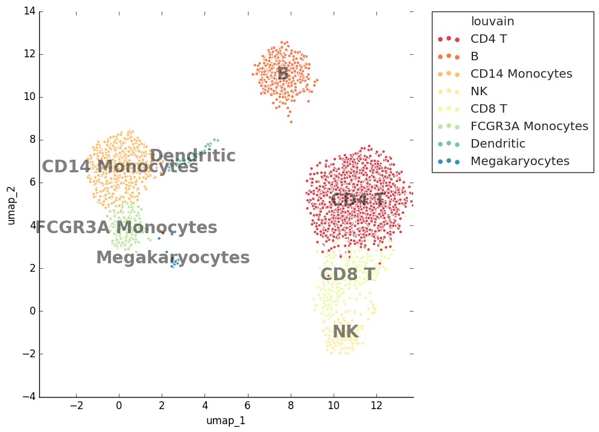
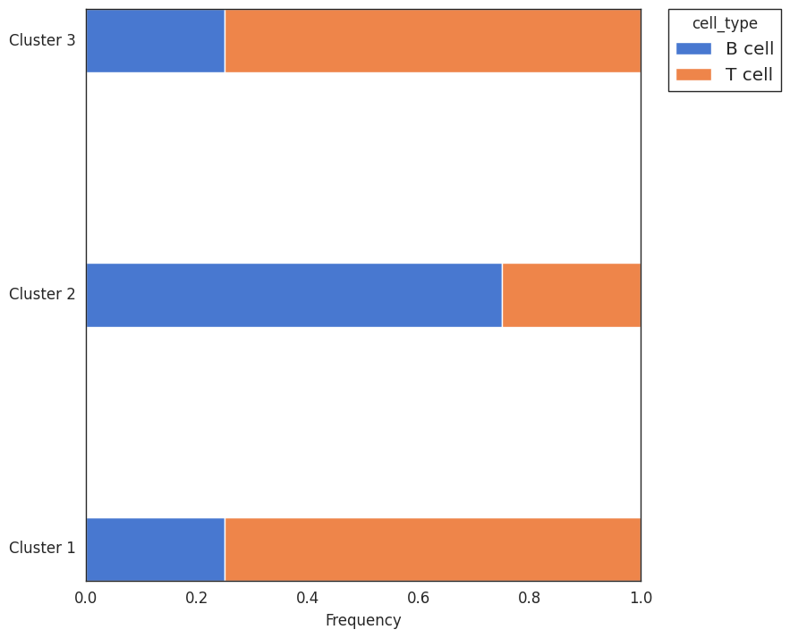

# genetools: single-cell analysis recipes (work in progress)


## Plot gallery

<table>
<tr>
<td>

[](https://github.com/maximz/genetools/blob/master/tests/test_plots.py)

</td>
<td>

[](https://github.com/maximz/genetools/blob/master/tests/test_plots.py)

</td>
</tr>
</table>

## Other features

* Compare clustering results by computing co-clustering percentage.
* Map marker genes against reference lists to find names for your clusters.
* pandas shotrcuts:
  * Split single cell barcodes conveniently.
  * Defensive pandas merging and concatenation methods with strict correctness checks.

Full documentation: [https://genetools.maximz.com](https://genetools.maximz.com).

## Install

Run `pip install --upgrade genetools[scanpy]`. Exclude brackets if you don't use scanpy.

## Usage

To use genetools in a project, add `import genetools`. Review the [documentation](https://genetools.maximz.com) and the [tests](https://github.com/maximz/genetools/tree/master/tests) for examples.

## Development

Setup:

```
git clone git://github.com/maximz/genetools
cd genetools
pip install -r requirements_dev.txt
pre-commit install
```

Common commands:

```
# lint
make lint

# run tests
make test

# generate baseline figures (run from root directory)
make regen-tests

# bump version before submitting a PR against master (all master commits are deployed)
bump2version patch # possible: major / minor / patch

# also ensure CHANGELOG.md updated
```

CI:
- Main: https://travis-ci.com/github/maximz/genetools
- Docs: https://app.netlify.com/sites/genetools
