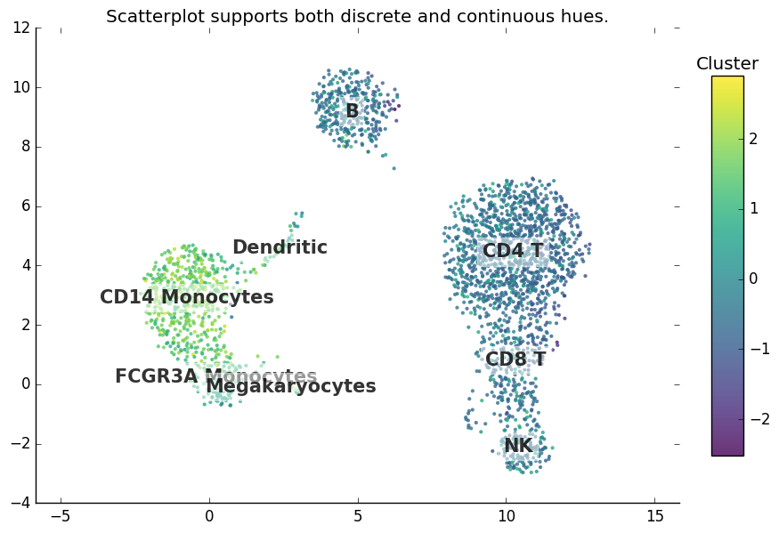
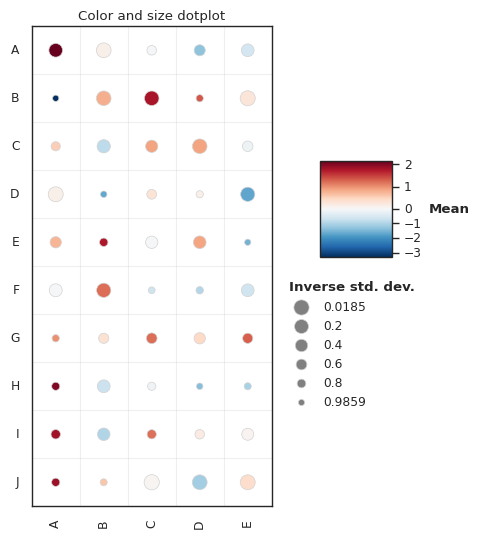

# genetools: single-cell analysis recipes (work in progress)

[](https://pypi.python.org/pypi/genetools)
[](https://github.com/maximz/genetools/actions/workflows/ci.yaml)
[](https://genetools.maximz.com)
[](https://github.com/maximz/genetools)
[](https://codecov.io/gh/maximz/genetools)

## Plot gallery

<table>
<tr>
<td>

[](https://github.com/maximz/genetools/blob/master/tests/test_plots.py#:~:text=def%test_scatterplot_discrete)

</td>
<td>

[](https://github.com/maximz/genetools/blob/master/tests/test_plots.py#:~:text=def%test_stacked_bar_plot)

</td>
</tr>

<tr>
<td>

[](https://github.com/maximz/genetools/blob/master/tests/test_plots.py#:~:text=def%test_scatterplot_continuous)

</td>
<td>

[](https://github.com/maximz/genetools/blob/master/tests/test_plots.py#:~:text=def%test_stacked_bar_plot_autocompute_frequencies)

</td>
</tr>

<tr>
<td>

[](https://github.com/maximz/genetools/blob/master/tests/test_plots.py#:~:text=def%20test_dotplot)

</td>
<td>

[](https://github.com/maximz/genetools/blob/master/tests/test_plots.py#:~:text=def%test_relative_density)

</td>
</tr>

</table>

## Other features

* Compare clustering results by computing co-clustering percentage.
* Map marker genes against reference lists to find names for your clusters.
* pandas shotrcuts:
  * Split single cell barcodes conveniently.
  * Defensive pandas merging and concatenation methods with strict correctness checks.

Full documentation: [https://genetools.maximz.com](https://genetools.maximz.com).

## Install

Run `pip install --upgrade 'genetools[scanpy]'`.

Or if you don't use scanpy: `pip install --upgrade genetools`.

## Usage

To use genetools in a project, add `import genetools`. Review the [documentation](https://genetools.maximz.com) and the [tests](https://github.com/maximz/genetools/tree/master/tests) for examples.

## Development

Setup:

```bash
git clone git://github.com/maximz/genetools
cd genetools
pip install --upgrade pip wheel
pip install -r requirements_dev.txt
pre-commit install
```

Common commands:

```bash
# lint
make lint

# one-time: generate test anndata, and commit so we have reproducible tests in CI
rm -r data
make regen-test-data

# run tests locally
# this is done in a debian-based docker image to ensure image style matches what Github Actions CI will produce
# failing image snapshot tests are recorded in tests/results/
make build-docker-test-image # whenever requirements_dev.txt change
make test

# generate baseline figures (also happens in docker)
make regen-snapshot-figures

# regenerate test data, and baseline figures (also happens in docker)
make regen-test-data

# run tests locally without docker, therefore omitting the snapshot tests
# (the @snapshot_image tests are still executed but the images are not compared. the @pytest.mark.snapshot_custom are skipped altogether.)
make test-without-figures

# docs
make docs

# bump version before submitting a PR against master (all master commits are deployed)
bump2version patch # possible: major / minor / patch

# also ensure CHANGELOG.md updated
```

CI:

- Main: Github Actions
- Docs: [https://app.netlify.com/sites/genetools](https://app.netlify.com/sites/genetools)
